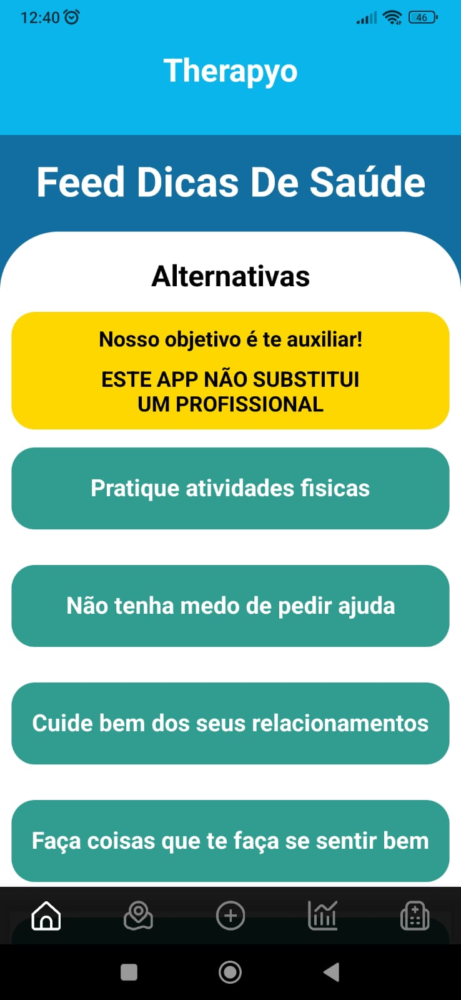
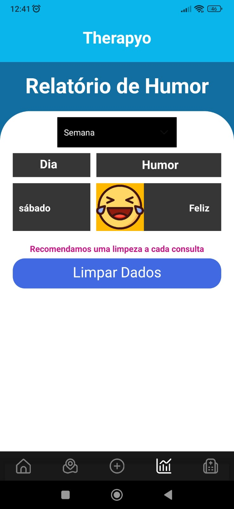

### APP Therapyo - 2024

> 👨‍💻 Equipe de Desenvolvimento:

    Gustavo Alfredo
    Caio Felipe
    Christyan Machado
    Gabriel Mensato
    Vinicius Camacho
    Eduardo Zanzin

> 🔨 Liguagem e Banco de Dados:

    Linguagem de Programação: React Native(JavaScript)
    Banco de dados: local(dispositivo)

> 🛠️ Ferramentas

IDEA: [Visual Studio Code](https://code.visualstudio.com/) &nbsp;&middot;&nbsp;  
Expo Dev: [Expo](https://expo.dev/) &nbsp;&middot;&nbsp;  

## 📷 Telas

 
  

## 🕹️ Como iniciar o projeto

1 - No cmd digite: git clone https://github.com/Gustavocorrea0/Therapyo.git 
2 - Extraia o arquivo .zip para o local desejado 
3 - Abra o projeto no [Visual Studio Code](https://code.visualstudio.com/) &nbsp;&middot;&nbsp; 
4 - No cmd digite: npm install 
5 - Aguarde a instalação das dependencias 
6 - No cmd digite: npx expo start 
7 - Ou no cmd digite: npm start 
8 - Aguarde a inicialização do projeto 
9 - Para utilizar no celular escaneie o qr code 
10 - Para utilizar no emulador digite A no terminal 

